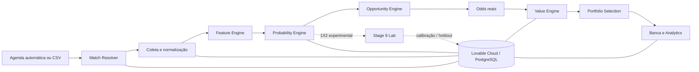

# Motor de Decisão Esportiva

> **Case full-stack de engenharia de produto, dados e decisão quantitativa aplicado a futebol.**


O **Motor de Decisão Esportiva** é uma aplicação full-stack para análise pré-jogo de futebol. Ela resolve partidas, coleta e normaliza dados, produz probabilidades experimentais, compara essas probabilidades com odds reais e aplica regras determinísticas antes de apresentar qualquer oportunidade.

O projeto começou como protótipo low-code e evoluiu para uma arquitetura versionada com **React, TanStack Start, TypeScript, Lovable Cloud, PostgreSQL, APIs externas, migrations, testes automatizados, CI e governança técnica**.

A aplicação publicada é protegida por autenticação e **não executa apostas**. O objetivo deste repositório é demonstrar engenharia de produto, dados, backend, modelagem quantitativa, segurança e capacidade de transformar um protótipo low-code em software auditável.

**Produção:** https://quant-football-insights.lovable.app  
**Case de portfólio:** [docs/CASE_STUDY.md](docs/CASE_STUDY.md)  
**Arquitetura:** [docs/ARCHITECTURE.md](docs/ARCHITECTURE.md)  
**Estado operacional canônico:** [docs/PROJECT_STATE.md](docs/PROJECT_STATE.md)

---

# Continuidade obrigatória — leia antes de alterar qualquer coisa

Esta seção existe para permitir que o projeto seja retomado corretamente mesmo sem acesso a conversas anteriores.

## Identidade canônica do projeto

| Item | Valor |
| --- | --- |
| Repositório GitHub | `kauefsantos/motor-de-decisao-esportiva` |
| Lovable canônico | `28664075-8af4-4155-9ee9-8ed86021681a` |
| Workspace Lovable | `IgC7Z3MS5vlDXWjvizgE` |
| Produção | `https://quant-football-insights.lovable.app` |
| Banco/runtime | **Lovable Cloud** |
| Timezone operacional | `America/Sao_Paulo` |

### Não confundir com o projeto antigo

O repositório `kauefsantos/quant-football-insights` é outro projeto e **não é a fonte canônica deste produto**.

Ao continuar o trabalho:

- use somente `kauefsantos/motor-de-decisao-esportiva` como repositório;
- use somente o projeto Lovable `28664075-8af4-4155-9ee9-8ed86021681a`;
- **não crie outro projeto Lovable** para continuar o desenvolvimento;
- chame o banco/runtime de **Lovable Cloud** em toda comunicação sobre o projeto.

O diretório `supabase/` permanece no repositório por convenção técnica de migrations, testes e tooling PostgreSQL. Isso não muda a nomenclatura operacional: para este projeto, o runtime deve ser tratado como **Lovable Cloud**.

## Regra de ouro de estado

Nunca tratar os estados abaixo como equivalentes:

```text
implementado ≠ testado ≠ mergeado ≠ sincronizado ≠ publicado ≠ validado em produção
```

Uma alteração só deve ser descrita com o estado que foi realmente comprovado.

## Protocolo obrigatório para qualquer próximo trabalho

Antes de corrigir, alterar ou concluir qualquer funcionalidade:

1. consultar o `main` atual do GitHub;
2. ler este `README.md` e `docs/PROJECT_STATE.md`;
3. consultar o projeto Lovable canônico e o último commit sincronizado;
4. consultar o estado vivo do Lovable Cloud quando a tarefa envolver banco, jobs, migrations, modelo, automação ou dados;
5. não assumir erro, sincronização, publicação ou estado de job sem evidência;
6. se houver alteração de código, usar **branch → alteração → PR → todos os gates obrigatórios verdes → merge**;
7. **não fazer merge com teste pendente, bloqueado ou falhando**;
8. após o merge, confirmar que o `main` e o Lovable chegaram ao mesmo commit;
9. publicar/deployar quando necessário;
10. validar o comportamento vivo depois da publicação;
11. ao relatar o resultado, separar explicitamente o que foi implementado, testado, mergeado, publicado e validado em produção.

Se uma data programada já tiver passado, isso **não prova** que a automação executou. Consulte o Lovable Cloud antes de afirmar que ocorreu.

---

# Estado funcional atual

## Visão resumida

| Área | Estado |
| --- | --- |
| Aplicação full-stack | Operacional |
| Autenticação e autorização | Implementadas e cobertas por regressões |
| Lovable Cloud / migrations | Versionadas, testadas e publicadas |
| Pipeline principal | Operacional com checkpoints, retries e retomada |
| Elo hierárquico | Automatizado e auditável |
| Motor de valor | Regras determinísticas de probabilidade, odd, EV e edge |
| Modelo 1X2 de uso diário | **Experimental** |
| Stage 9 | Laboratório estatístico em background |
| Certificação estatística formal | **Não concluída** |
| Stake real | Bloqueada enquanto o modelo exato não estiver validado |
| Execução automática de apostas | Não existe |

O produto opera atualmente em **dual-track**: um trilho experimental utilizável no dia a dia e um laboratório estatístico independente que tenta validar formalmente o mesmo modelo sem relaxar os gates.

---

# Dual-track atual

## Trilho A — Modo diversão / experimental

Modelo 1X2 atual:

```text
goals-baseline-v2-recency+elo-v1-w020+1x2-uncertainty-linear-v1-w040
```

Fluxo conceitual:

```text
Goals+Elo
→ Elo-Davidson com mando +60
→ uncertainty-linear com peso máximo de 40%
→ distribuição HOME / DRAW / AWAY
```

Fórmula do blend:

```text
incerteza = 1 - (maior probabilidade BASE - segunda maior probabilidade BASE)
peso_elo = 0,40 * incerteza
P_final = (1 - peso_elo) * P_goals+elo + peso_elo * P_elo_davidson60
```

As probabilidades HOME/DRAW/AWAY são normalizadas após o blend.

### Escopo do modelo

- `1x2`: usa o ensemble quando existe histórico point-in-time suficiente;
- `double_chance`: deriva da mesma distribuição 1X2;
- mercados de gols continuam usando suas próprias lambdas e não recebem o blend 1X2;
- sem histórico auxiliar suficiente, o sistema mantém o caminho de gols e registra fallback;
- confrontos interligas/continentais não recebem silenciosamente a fórmula doméstica sem validação específica.

### Evidência retrospectiva que motivou a integração

Na janela pareada de 1.017 partidas:

| Métrica | Incumbent | uncertainty-linear 40% |
| --- | ---: | ---: |
| Brier | 0,62560 | **0,62288** |
| LogLoss | 1,03957 | **1,03621** |
| ECE | 3,39% | **3,01%** |
| Max calibration gap | 29,92% | **20,26%** |

O candidato melhorou as métricas retrospectivas, mas o max calibration gap continuou acima do gate canônico de **10 p.p.**. Portanto, integração técnica **não equivale a validação de produção**.

### Regras canônicas de seleção

Uma oportunidade do modo atual precisa respeitar:

- probabilidade **≥ 70%**;
- odd **≥ 1,70**;
- EV **≥ 8%**;
- edge **≥ 5 p.p.**;
- máximo de **3** oportunidades finais;
- máximo de **1** oportunidade principal por partida;
- máximo de **2** oportunidades da mesma família;
- **zero oportunidades é um resultado válido**.

A UI deve deixar claro que este é **Modo diversão · experimental ativo**.

O modo diversão continua disponível mesmo quando o registro do modelo está como `NOT_PRODUCTION_VALIDATED`. Isso não desbloqueia stake real e não transforma o modelo em certificado.

---

## Trilho B — Stage 9 / laboratório estatístico

A Stage 9 existe para calibrar e validar o modelo direcional congelado. Ela trabalha em background e **não bloqueia o modo diversão**.

Ela não deve alterar para buscar aprovação:

- a fórmula uncertainty-linear;
- peso 0,40;
- Elo +60;
- Davidson;
- lambdas de gols;
- thresholds de decisão;
- definição do holdout final.

### Protocolo temporal

| Etapa | Janela |
| --- | --- |
| Fit interno | antes de 01/04/2026 |
| Seleção interna | 01/04/2026 a 31/05/2026 |
| Refit congelado | somente dados anteriores a 01/06/2026 |
| Shadow retrospectivo | 01/06/2026 a 13/09/2026 |
| Holdout prospectivo intocado | a partir de 14/09/2026 |

A retrospectiva não pode selecionar hiperparâmetros do holdout final. O holdout prospectivo não participa de fitting, seleção, tuning ou escolha de família.

### Gates para `SHADOW_READY`

Todos precisam passar simultaneamente:

- fit `n >= 1.000`;
- seleção `n >= 300`;
- shadow retrospectivo `n >= 300`;
- candidato elegível na seleção temporal;
- Brier calibrado não piorar;
- LogLoss calibrado não piorar;
- max calibration gap `<= 0,10`;
- cobertura de estabilidade temporal e por liga;
- pelo menos metade dos períodos elegíveis preservando simultaneamente Brier e LogLoss;
- pelo menos metade das ligas com `n >= 30` preservando simultaneamente Brier e LogLoss;
- ausência de leakage temporal.

### Holdout e `PRODUCTION_VALIDATED`

O holdout final:

- começou em `14/09/2026`;
- precisa de pelo menos **200 fixtures settled/intocadas**;
- exige previsão anterior ao kickoff;
- exige placar final sem conflito;
- não pode reutilizar retrospectiva como substituto.

Para `HOLDOUT_PASSED` são obrigatórios simultaneamente:

- `n >= 200`;
- Brier calibrado <= Brier bruto;
- LogLoss calibrado <= LogLoss bruto;
- max calibration gap <= 10 p.p.;
- pelo menos 3 ligas com `n >= 20`;
- estabilidade de scoring em pelo menos metade das ligas elegíveis;
- zero leakage.

Somente a promoção governada:

```text
promote_stage9_1x2_if_holdout_passed()
```

pode alterar o registro exato para `PRODUCTION_VALIDATED`, depois de revalidar fit, shadow, holdout, amostra, calibração e estabilidade.

**Não existe caminho válido por override, redução artificial do gate de 10 p.p., reutilização do retrospectivo como holdout ou alteração manual do status.**

### Governança financeira preservada

- Kelly: `0,25`;
- teto informacional de stake: `1%`;
- stake real bloqueada enquanto a versão exata não estiver `PRODUCTION_VALIDATED`.

---

# Snapshot operacional conhecido da Stage 9

> Snapshot de 14/09/2026. Sempre reconsultar o Lovable Cloud antes de usar estes valores como estado atual.

Foi confirmado no ambiente vivo:

- migration-base da Stage 9 aplicada e registrada;
- migration de orquestração/notificações dual-track aplicada e registrada;
- registry do modelo presente;
- RPCs de calibração, holdout e promoção presentes;
- `private.model_lab_events` presente;
- feed owner-scoped acessado server-side;
- `anon` e `authenticated` sem execução direta do feed;
- `service_role` com execução permitida;
- trigger de eventos presente;
- cron `stage9-daily-lab` ativo;
- evento `LAB_ENABLED` registrado;
- status do modelo: `NOT_PRODUCTION_VALIDATED`;
- no momento do snapshot: `0` jobs Stage 9 executados e `0` artefatos Stage 9.

Agenda do laboratório:

```text
06:15 America/Sao_Paulo → execução principal
06:20 America/Sao_Paulo → janela de recuperação
```

A primeira janela automática natural após a instalação ficou programada para **15/09/2026 às 06:15**. Em qualquer retomada posterior a essa data, **não presumir que executou**: consultar jobs, artefatos, eventos e status vivo antes de afirmar resultado.

Consultas prioritárias ao retomar a Stage 9:

1. registro do modelo em `model_versions`;
2. artefatos em `private.model_calibration_artifacts`;
3. jobs recentes em `private.model_validation_jobs`;
4. dispatches em `public.automation_runs`;
5. eventos em `private.model_lab_events`;
6. cron e histórico de execução quando disponível.

Não alterar fórmula nem relaxar gate só para obter aprovação.

---

# Fluxo principal do produto

## Automático diário D+2

```text
12:45 America/Sao_Paulo
→ descobrir calendário D+2 na 5DollarFootballAPI
→ filtrar competições ativas do escopo Elo
→ persistir fixture/time/liga por IDs oficiais
→ COLLECT
→ CLEAN
→ FEATURES
→ PROBABILITY
→ GATES
→ MARKETS
→ READY_FOR_ODDS
→ emitir ANALYSIS_READY somente quando o pipeline terminar
→ usuário confere odds e decide
```

Recuperações curtas previstas:

```text
12:50
12:55
13:00
```

Regras importantes:

- identidade de fixture/time/liga usa IDs oficiais; nomes são rótulos;
- chave determinística owner/data impede duplicação de runs;
- leases, retries e worker existentes são reutilizados;
- partidas já concluídas não devem ser reprocessadas;
- não criar run vazio quando não houver partidas elegíveis;
- a automação prepara a análise, mas não congela odd como preço definitivo.

## Manual / contingência

```text
Enviar CSV
→ validar partidas
→ RESOLVE
→ COLLECT
→ CLEAN
→ FEATURES
→ PROBABILITY
→ GATES
→ MARKETS
→ conferir odds
→ fila de decisão
→ revisar
→ registrar aposta realizada fora do sistema
→ acompanhar resultado e analytics
```

O CSV é contingência. A aplicação **não executa apostas**.

---

# Arquitetura



## Princípio central

**Probabilidade e preço são separados.** A odd da casa não entra como feature do motor esportivo. Primeiro o sistema estima o cenário; depois compara essa estimativa com o preço disponível.

## Processamento resiliente

O runtime utiliza:

- jobs persistidos;
- leases;
- heartbeat;
- checkpoints por etapa;
- retries controlados;
- retomada de jobs parados;
- coleta em batches;
- reconciliação de trabalho parcial;
- proteção contra processamento duplicado;
- rechain/dispatch governados.

## Elo

O Elo inclui:

- ratings domésticos;
- hierarquia entre divisões/ligas;
- comparação cross-league;
- reconstrução point-in-time;
- fechamento diário com rebuild e auditoria sem duplicação do mesmo trabalho.

---

# Segurança e boundaries

Princípios vigentes:

- segredos somente server-side;
- acesso privilegiado ao Lovable Cloud não pode vazar para código client-side;
- RPCs sensíveis são encapsuladas em repositories/server functions;
- dados owner-scoped devem permanecer owner-scoped;
- tabelas privadas de validação não são lidas diretamente pelo browser;
- migrations são versionadas;
- RLS/regressões SQL fazem parte do CI;
- mudanças de comportamento governado precisam de documentação correspondente.

A Home e a central **Laboratório Stage 9** mostram apenas os dados necessários ao usuário, sem transformar tabelas privadas do laboratório em API pública de browser.

---

# CI e regra de merge

Antes de qualquer merge de código, a cadeia atual cobre:

```text
architecture + lint + typecheck
→ dependency vulnerability gate
→ repository secret scan
→ server secret boundary
→ governance documentation gate
→ versioned route tree
→ Lovable Cloud migrations + regressions
→ functional decision-flow E2E
→ experimental engine E2E
→ unit tests
→ production build
→ bundle performance budget
→ concurrent load smoke
→ Chromium + Firefox + WebKit
→ responsive + accessibility checks
```

## Regra obrigatória

**Não fazer merge com qualquer gate obrigatório pendente, bloqueado ou falhando.**

Depois do merge:

```text
confirmar GitHub main
→ confirmar commit recebido pelo Lovable
→ aguardar sincronização completar
→ publicar/deployar se necessário
→ validar runtime/Lovable Cloud
→ só então declarar publicação/validação concluída
```

---

# O que não deve ser alterado casualmente

Sem uma decisão explícita e evidência correspondente, preservar:

- repositório e projeto Lovable canônicos;
- nomenclatura **Lovable Cloud**;
- fórmula 1X2 uncertainty-linear 40%;
- Elo-Davidson +60;
- probabilidade mínima 70%;
- odd mínima 1,70;
- EV mínimo 8%;
- edge mínimo 5 p.p.;
- máximo 3 picks;
- máximo 1 pick principal por partida;
- máximo 2 da mesma família;
- gate de max calibration gap em 10 p.p.;
- Kelly 0,25;
- teto informacional de stake 1%;
- bloqueio de stake real para modelo não validado;
- holdout prospectivo >= 200 fixtures settled/intocadas;
- zero picks como resultado válido;
- separação entre modo diversão e certificação Stage 9;
- princípio de não usar dados posteriores ao prediction time;
- princípio de não extrapolar silenciosamente modelo doméstico para domínio interligas.

---

# Stack

| Camada | Tecnologias |
| --- | --- |
| Frontend | React 19, TanStack Start/Router, TypeScript, Tailwind CSS |
| Backend | TanStack server functions, TypeScript |
| Dados/runtime | Lovable Cloud, PostgreSQL, RPCs, triggers, migrations |
| Integrações | 5DollarFootballAPI e adapters server-side |
| Qualidade | Vitest, pgTAP, Playwright, axe, GitHub Actions |
| Produto / low-code | Lovable |

A lógica crítica não fica dependente do construtor visual: regras quantitativas, autorização, migrations, integrações, testes e contratos permanecem versionados no GitHub.

---

# Estrutura do repositório

```text
src/
  components/                 interface
  integrations/               integração técnica do runtime
  lib/adapters/               provedores e normalização
  lib/application/            casos de uso
  lib/domain/                 regras de domínio
  lib/engine/                 modelos e regras quantitativas puras
  lib/repositories/           persistência
  routes/                     rotas TanStack

supabase/
  migrations/                 migrations do Lovable Cloud
  tests/                      regressões SQL/RLS

docs/
  PROJECT_STATE.md            estado operacional canônico
  ARCHITECTURE.md             arquitetura e boundaries
  CASE_STUDY.md               narrativa de portfólio
  GOVERNANCE.md               governança técnica
  ELO.md                      arquitetura do Elo
  ELO_RUNBOOK.md              operação e troubleshooting
  governance/                 decisões, protocolos e evidências versionadas
```

---

# Executando localmente

```bash
bun install
bun run dev
```

Validação principal:

```bash
bun run check
bunx vitest run
bun run build
```

O ambiente completo depende de integrações externas e do Lovable Cloud. **Credenciais reais não são versionadas.**

---

# Documentação principal

| Documento | Função |
| --- | --- |
| [PROJECT_STATE.md](docs/PROJECT_STATE.md) | fonte canônica de estado operacional |
| [ARCHITECTURE.md](docs/ARCHITECTURE.md) | arquitetura e boundaries |
| [CASE_STUDY.md](docs/CASE_STUDY.md) | narrativa profissional/portfólio |
| [GOVERNANCE.md](docs/GOVERNANCE.md) | governança técnica |
| [ELO.md](docs/ELO.md) | Elo doméstico, hierárquico e point-in-time |
| [ELO_RUNBOOK.md](docs/ELO_RUNBOOK.md) | operação e troubleshooting do Elo |
| [1X2_UNCERTAINTY_LINEAR_40_2026-09-14.md](docs/governance/1X2_UNCERTAINTY_LINEAR_40_2026-09-14.md) | fórmula 1X2 experimental atual |
| [STAGE9_1X2_ENSEMBLE_CALIBRATION_2026-09-14.md](docs/governance/STAGE9_1X2_ENSEMBLE_CALIBRATION_2026-09-14.md) | protocolo de calibração/holdout Stage 9 |
| [STAGE9_DUAL_TRACK_LAB.md](docs/governance/STAGE9_DUAL_TRACK_LAB.md) | separação modo diversão / laboratório |
| [SCHEDULED_D2_ANALYSIS_2026-09-12.md](docs/governance/SCHEDULED_D2_ANALYSIS_2026-09-12.md) | automação diária D+2 |
| [SECURITY.md](SECURITY.md) | política de segurança |
| [CONTRIBUTING.md](CONTRIBUTING.md) | padrão de branch, PR, testes e governança |

---

# Checklist para um novo chat/agente

Ao receber este repositório sem contexto anterior:

1. **não começar alterando código**;
2. confirmar que está em `kauefsantos/motor-de-decisao-esportiva`;
3. confirmar o `main` atual;
4. ler `README.md` e `docs/PROJECT_STATE.md`;
5. confirmar que o Lovable é `28664075-8af4-4155-9ee9-8ed86021681a` no workspace `IgC7Z3MS5vlDXWjvizgE`;
6. confirmar o último commit sincronizado pelo Lovable;
7. consultar o Lovable Cloud se a tarefa depender do estado vivo;
8. preservar dual-track e gates de negócio;
9. nunca promover manualmente o modelo para `PRODUCTION_VALIDATED`;
10. nunca relaxar os gates para fabricar picks;
11. executar mudanças por branch/PR/gates verdes;
12. após merge, sincronizar/publicar/validar;
13. no fechamento, registrar com precisão o que está apenas implementado e o que está realmente validado em produção.

Se a tarefa for especificamente continuar a Stage 9, começar pela auditoria de **jobs, artefatos, eventos, cron e status do modelo** antes de qualquer intervenção.

---

# O que este projeto demonstra

- transformar um processo ambíguo em regras de negócio explícitas;
- usar low-code como acelerador sem delegar lógica crítica ao construtor;
- integrar APIs externas com lineage e normalização;
- modelar processamento resiliente com checkpoint e retomada;
- aplicar TypeScript e PostgreSQL em regras transacionais;
- separar previsão, preço, decisão e execução;
- separar exploração experimental de certificação estatística;
- construir CI com segurança, regressão, performance, browsers e acessibilidade;
- manter limitações quantitativas visíveis em vez de mascará-las como certeza;
- manter continuidade operacional documentada mesmo quando o histórico de conversa não está disponível.

O resultado é um **case de product engineering orientado por dados**, com foco em rastreabilidade, disciplina técnica e evolução contínua.

---

# Uso e licença

Este repositório é publicado como **case de portfólio**. A aplicação e seus modelos são experimentais e não constituem recomendação financeira, garantia de resultado ou serviço de execução de apostas.

Não há licença open source explícita. A publicação do código não implica autorização automática para reutilização, redistribuição ou exploração comercial.
