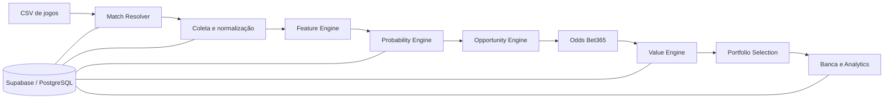

# Motor de Decisão Esportiva

> **Case de produto low-code com engenharia de dados, regras quantitativas, integrações externas e governança de software.**


O **Motor de Decisão Esportiva** é uma aplicação full-stack para análise pré-jogo de futebol. O projeto começou com uma abordagem low-code e foi evoluindo até se tornar um produto versionado, testado e auditável, com backend próprio, banco PostgreSQL/Supabase, integrações com API esportiva, regras de negócio determinísticas, autenticação, CI e controles de segurança.

A proposta de portfólio aqui não é apenas mostrar uma interface criada com low-code, mas demonstrar como **low-code + código tradicional** podem trabalhar juntos: rapidez de prototipação onde faz sentido e engenharia explícita nos pontos em que confiabilidade, dados, segurança e regras de negócio importam.

**A aplicação publicada permanece protegida por autenticação.** O repositório existe como case técnico e de produto, documentando arquitetura, decisões e evolução.

[Ver case de portfólio](docs/CASE_STUDY.md) · [Ver arquitetura](docs/ARCHITECTURE.md) · [Índice técnico](docs/README.md)

---

## O problema que o projeto resolve

Analisar uma lista de jogos exige combinar informações de várias fontes, padronizar partidas e competições, modelar probabilidades, comparar essas probabilidades com preços reais e ainda manter rastreabilidade sobre o que foi calculado.

O sistema transforma esse processo em um fluxo guiado:

1. **Enviar jogos** — upload de CSV com `Data`, `Partida`, `Horário` e `Campeonato`.
2. **Preparar análise** — resolução das partidas, coleta e higienização dos dados e geração das probabilidades.
3. **Conferir odds** — preenchimento automático quando existe preço seguro; conferência manual apenas quando necessário.
4. **Analisar valor** — comparação entre probabilidade modelada e odd disponível.
5. **Ver sugestões** — seleção final limitada por critérios de valor e correlação.
6. **Acompanhar banca** — registro das apostas realmente feitas fora do sistema e leitura do desempenho.

O produto **não executa apostas** e não força seleções quando os critérios não são atendidos.

---

## Arquitetura do produto



A separação entre **probabilidade** e **preço** é uma regra estrutural do sistema: a odd da casa não entra como feature no modelo de probabilidade. Primeiro o sistema estima o cenário esportivo; só depois compara esse cenário com o preço disponível.

---

## Onde entra o low-code

| Camada | Abordagem | Papel no projeto |
| --- | --- | --- |
| Interface e iteração rápida | **Lovable + React/Tailwind** | Prototipação, refinamento visual e velocidade de entrega |
| Regras de negócio | **TypeScript versionado** | Probabilidade, EV, seleção, banca e contratos de mercado |
| Dados | **Supabase / PostgreSQL** | Persistência, transações, RLS e auditoria |
| Integrações | **APIs externas + adapters** | Coleta esportiva e odds Bet365 via 5DollarFootballAPI |
| Qualidade | **Vitest + GitHub Actions** | Testes, build e validações automatizadas |
| Segurança | **Auth + RLS + server boundary** | Controle de acesso e isolamento de credenciais |

A principal decisão de arquitetura foi não deixar a lógica crítica presa ao construtor visual. A interface pode evoluir rapidamente no Lovable, enquanto regras quantitativas, migrations, testes e contratos permanecem versionados no GitHub.

---

## Destaques funcionais

- Upload e validação de CSV.
- Resolução e normalização de partidas.
- Integração com dados esportivos e odds da Bet365.
- Modelos para gols, escanteios e cartões.
- Elo hierárquico como feature auxiliar.
- Probabilidade, fair odd, edge e EV calculados no backend.
- Funil progressivo de odds manuais quando a API não possui preço seguro.
- Seleção com controle de correlação entre apostas do mesmo jogo.
- Limite operacional de sugestões por dia.
- Banca experimental com confirmação e settlement transacionais.
- Analytics somente leitura com histórico de performance.
- CLV e métricas de acompanhamento para evolução quantitativa.

---

## Destaques de engenharia

### Separação de responsabilidades

O projeto possui dois estágios distintos:

**Motor de probabilidade**

- trabalha sem conhecer a odd da casa;
- usa somente dados disponíveis antes do momento da previsão;
- bloqueia mercados quando os dados não sustentam uma previsão confiável.

**Motor de valor**

- recebe a odd real depois da previsão;
- calcula preço justo, edge e valor esperado;
- só seleciona uma aposta quando os critérios continuam válidos.

### Integridade e segurança

- Google login com autorização validada no servidor.
- Service role restrita ao backend.
- RLS habilitado nas tabelas públicas.
- Browser sem privilégios diretos sobre o banco operacional.
- Operações de banca serializadas no banco.
- Limite diário protegido também no banco, não apenas na interface.
- Headers de segurança, CSP e políticas de cache configurados no servidor.

### Qualidade contínua

O GitHub Actions executa:

```text
Install dependencies
→ Server secret boundary
→ Experimental engine E2E
→ Unit tests
→ Production build
```

As mudanças relevantes passaram por auditorias separadas de **RLS, Segurança, Backend e Frontend**, seguidas por uma rodada específica de limpeza de código.

---

## Stack

**Frontend**

- React 19
- TanStack Start / Router
- TypeScript
- Tailwind CSS
- Lovable

**Backend e dados**

- TanStack server functions
- Supabase / PostgreSQL
- PostgreSQL RPCs, triggers e migrations versionadas
- 5DollarFootballAPI Pro

**Qualidade e entrega**

- Vitest
- GitHub Actions
- Bun
- Lovable Cloud

---

## Estrutura do repositório

```text
src/
  components/               UI específica da aplicação
  integrations/             Lovable e Supabase
  lib/adapters/             integrações e normalização de dados
  lib/engine/               regras e modelos quantitativos
  lib/*.functions.ts        server functions
  routes/                   rotas TanStack

supabase/
  migrations/               evolução versionada do banco
  tests/                    testes de segurança/RLS

docs/
  CASE_STUDY.md             leitura de portfólio
  ARCHITECTURE.md            arquitetura e decisões
  README.md                  índice da documentação técnica
  PROJECT_STATE.md           estado operacional canônico
```

---

## Rodando localmente

```bash
bun install
bun run dev
```

Validação completa:

```bash
bunx vitest run
bun run build
bun run lint
```

> O ambiente completo depende de variáveis de integração e banco. Credenciais reais não ficam versionadas no repositório.

---

## Documentação

| Documento | Conteúdo |
| --- | --- |
| [Case Study](docs/CASE_STUDY.md) | problema, abordagem low-code, decisões e aprendizados |
| [Arquitetura](docs/ARCHITECTURE.md) | fluxo técnico, boundaries e fontes de verdade |
| [Índice técnico](docs/README.md) | mapa da documentação existente |
| [Estado do projeto](docs/PROJECT_STATE.md) | continuidade operacional do sistema |
| [Política de mercados](docs/BACKEND_MARKET_POLICY_2026-09-10.md) | contratos e linhas experimentais |
| [Validação quantitativa](docs/BACKEND_ROUND3_QUANT_VALIDATION_2026-09-10.md) | evidências e políticas dos modelos de contagem |
| [Auditoria de segurança](docs/SECURITY_AUDIT_2026-09-10.md) | hardening e riscos residuais |

---

## O que este projeto demonstra

Este repositório foi estruturado para mostrar competências que vão além da construção de telas:

- transformar uma ideia em produto funcional usando low-code de forma pragmática;
- traduzir regras de negócio em software versionado;
- integrar APIs e dados externos com normalização e rastreabilidade;
- modelar dados e regras transacionais em PostgreSQL;
- criar uma camada de segurança coerente com o risco do produto;
- evoluir UX com auditorias e testes de regressão;
- usar IA e ferramentas low-code como aceleradores, sem abrir mão de governança técnica.

O resultado é um **case de product engineering low-code**, em que velocidade de construção e controle técnico coexistem no mesmo fluxo de desenvolvimento.

---

## Uso e licença

Este repositório é publicado como **case de portfólio**. A aplicação e os modelos permanecem experimentais e não constituem recomendação financeira ou garantia de resultado.

O repositório não possui licença open source explícita; a publicação do código não implica autorização automática para reutilização, redistribuição ou exploração comercial.
