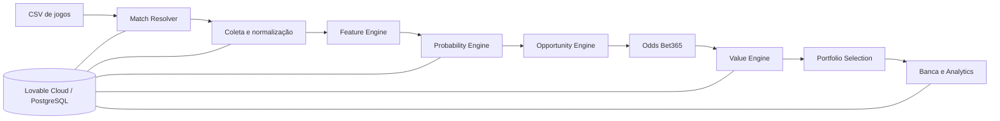

# Motor de Decisão Esportiva

> **Case full-stack de engenharia de produto, dados e decisão quantitativa aplicado a futebol.**


O **Motor de Decisão Esportiva** é uma aplicação full-stack para análise pré-jogo de futebol. Ela recebe partidas, resolve entidades, coleta e normaliza dados, produz probabilidades experimentais, confronta essas probabilidades com odds reais e aplica regras determinísticas antes de apresentar qualquer oportunidade.

O projeto começou com uma abordagem low-code e evoluiu para uma arquitetura versionada com **React, TanStack Start, TypeScript, Lovable Cloud, PostgreSQL, APIs externas, migrations, testes automatizados, CI e governança técnica**.

A aplicação publicada é protegida por autenticação e **não executa apostas**. O objetivo deste repositório é demonstrar engenharia de produto, dados, backend, modelagem quantitativa, segurança e capacidade de transformar um protótipo low-code em software auditável.

**Aplicação:** https://quant-football-insights.lovable.app  
**Case de portfólio:** [docs/CASE_STUDY.md](docs/CASE_STUDY.md)  
**Arquitetura:** [docs/ARCHITECTURE.md](docs/ARCHITECTURE.md)  
**Estado operacional:** [docs/PROJECT_STATE.md](docs/PROJECT_STATE.md)

---

## Status técnico

| Área | Estado |
| --- | --- |
| Aplicação full-stack | Operacional |
| Autenticação e autorização | Implementadas e cobertas por regressões |
| Lovable Cloud / migrations | Versionadas e testadas em CI |
| Pipeline de análise | Operacional com checkpoints e retomada |
| Elo hierárquico | Atualização automatizada e auditoria diária |
| Motor de valor | Regras determinísticas de odd, EV e edge |
| Probabilidades esportivas | **Experimentais; não devem ser confundidas com modelos production-validated** |
| Execução de apostas | Não existe; decisões são registradas para acompanhamento |

Essa distinção é deliberada: **um modelo implementado não é automaticamente um modelo validado**. O repositório preserva essa diferença em status, documentação e testes.

---

## Problema tratado

Uma análise pré-jogo séria precisa coordenar várias etapas que normalmente ficam espalhadas:

1. importar uma agenda de jogos;
2. resolver corretamente times, competição, mando e horário;
3. coletar somente informação disponível antes da previsão;
4. normalizar definições de dados entre fornecedores;
5. transformar histórico em distribuições e probabilidades;
6. consultar ou receber uma odd real;
7. calcular fair odd, edge e valor esperado;
8. bloquear contratos sem dados, settlement compatível ou validação suficiente;
9. limitar concentração e correlação das escolhas;
10. registrar decisão, stake, resultado e métricas posteriores.

O produto organiza esse processo em um fluxo único e auditável.

---

## Arquitetura



### Princípio central

**Probabilidade e preço são separados.** A odd da casa não entra como feature no motor esportivo. Primeiro o sistema estima o cenário; depois compara a estimativa com o preço disponível.

---

## Regra atual do funil final

Uma oportunidade só pode chegar à fila principal quando atende simultaneamente aos controles canônicos:

- probabilidade do modelo **≥ 70%**;
- odd real **≥ 1,70**;
- valor esperado **≥ 8%**;
- edge **≥ 5 pontos percentuais**;
- dados aprovados;
- linha recebida igual à linha modelada;
- prediction pertencente à run e partida corretas;
- odd automática ainda fresca;
- no máximo **3** oportunidades finais;
- no máximo **1 por partida**;
- no máximo **2 da mesma família**.

**Zero apostas é um resultado válido.** O sistema não preenche uma cota artificial de recomendações.

Essas regras são protegidas tanto no código quanto no Lovable Cloud.

---

## Modelagem quantitativa

O repositório contém infraestrutura para:

- gols com baseline Poisson, shrinkage, recência e ajuste Elo;
- escanteios com Poisson/Negative Binomial e dispersão estimada apenas no treino;
- cartões com proxy explicitamente marcado quando o fornecedor não reproduz exatamente o settlement da casa;
- Elo doméstico e hierárquico point-in-time;
- Brier score, log loss, MAE e calibração para validação temporal;
- versionamento de modelo e status de validação.

A política de governança é conservadora: quando calibração, dados ou equivalência de settlement não são suficientes, o correto é **bloquear o mercado**, não inventar uma probabilidade.

---

## Engenharia e qualidade

O CI executa uma cadeia ampla de gates antes de um merge:

```text
lint + typecheck + architecture boundaries
→ dependency vulnerability gate
→ secret scan
→ server secret boundary
→ governance documentation gate
→ database migrations + regressions
→ functional E2E
→ experimental engine E2E
→ unit tests
→ production build
→ bundle budget
→ concurrent load smoke
→ Chromium + Firefox + WebKit
→ responsive + accessibility checks
```

O projeto também mantém:

- branch `main` protegida;
- CODEOWNERS;
- migrations versionadas;
- regressões SQL;
- PRs focados por eixo;
- documentação de governança;
- política de segurança;
- distinção explícita entre **implementado, testado, mergeado, publicado e validado em produção**.

---

## Stack

| Camada | Tecnologias |
| --- | --- |
| Frontend | React 19, TanStack Start/Router, TypeScript, Tailwind CSS |
| Backend | TanStack server functions, TypeScript |
| Dados | Lovable Cloud, PostgreSQL, RPCs, triggers, migrations |
| Integrações | 5DollarFootballAPI e adapters server-side |
| Qualidade | Vitest, pgTAP, Playwright, axe, GitHub Actions |
| Produto / low-code | Lovable |

A lógica crítica não fica dependente do construtor visual: regras quantitativas, autorização, migrations, integrações, testes e contratos permanecem versionados no GitHub.

---

## Estrutura

```text
src/
  components/                 interface
  integrations/               integração técnica do runtime
  lib/adapters/               provedores e normalização
  lib/application/            casos de uso
  lib/domain/                 regras de domínio
  lib/engine/                 modelos e regras quantitativas puras
  lib/repositories/           persistência
  routes/                     rotas TanStack

supabase/
  migrations/                 migrations do Lovable Cloud
  tests/                      regressões SQL/RLS

docs/
  CASE_STUDY.md               narrativa de portfólio
  ARCHITECTURE.md             arquitetura e boundaries
  ELO.md                      arquitetura do Elo
  ELO_RUNBOOK.md              operação e troubleshooting
  PROJECT_STATE.md            continuidade operacional
  governance/                 evidências e decisões auditáveis
```

---

## Executando localmente

```bash
bun install
bun run dev
```

Validação principal:

```bash
bun run check
bunx vitest run
bun run build
```

O ambiente completo depende de integrações externas e do Lovable Cloud. **Credenciais reais não são versionadas.**

---

## Documentação principal

| Documento | Conteúdo |
| --- | --- |
| [Case Study](docs/CASE_STUDY.md) | problema, evolução low-code → engenharia e aprendizados |
| [Arquitetura](docs/ARCHITECTURE.md) | fluxo técnico, boundaries e fontes de verdade |
| [Estado do projeto](docs/PROJECT_STATE.md) | estado operacional canônico |
| [Elo](docs/ELO.md) | Elo doméstico, hierárquico e point-in-time |
| [Runbook Elo](docs/ELO_RUNBOOK.md) | jobs, auditoria e troubleshooting |
| [Política de mercados](docs/BACKEND_MARKET_POLICY_2026-09-10.md) | contratos e linhas |
| [Validação quantitativa](docs/BACKEND_ROUND3_QUANT_VALIDATION_2026-09-10.md) | evidências e critérios de modelos |
| [Segurança](SECURITY.md) | política de reporte e expectativas de segurança |
| [Contribuição](CONTRIBUTING.md) | padrão de branches, PRs, testes e governança |

---

## O que este projeto demonstra

- transformar um processo ambíguo em regras de negócio explícitas;
- usar low-code como acelerador sem delegar lógica crítica ao construtor;
- integrar APIs externas com lineage e normalização;
- modelar processamento resiliente com checkpoint e retomada;
- aplicar TypeScript e PostgreSQL em regras transacionais;
- separar previsão, preço, decisão e execução;
- construir CI com segurança, regressão, performance, browsers e acessibilidade;
- manter limitações quantitativas visíveis em vez de mascará-las como certeza.

O resultado é um **case de product engineering orientado por dados**, com foco em rastreabilidade, disciplina técnica e evolução contínua.

---

## Uso e licença

Este repositório é publicado como **case de portfólio**. A aplicação e seus modelos são experimentais e não constituem recomendação financeira, garantia de resultado ou serviço de execução de apostas.

Não há licença open source explícita. A publicação do código não implica autorização automática para reutilização, redistribuição ou exploração comercial.