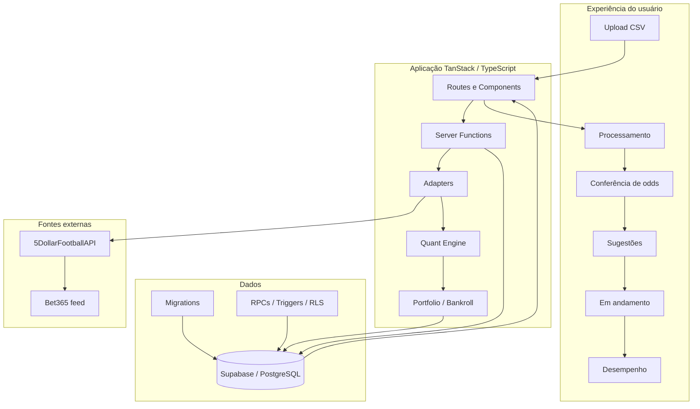
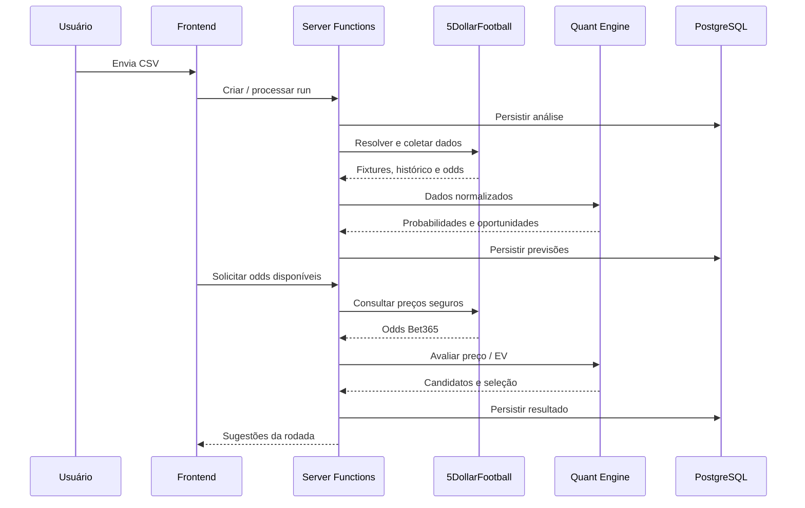
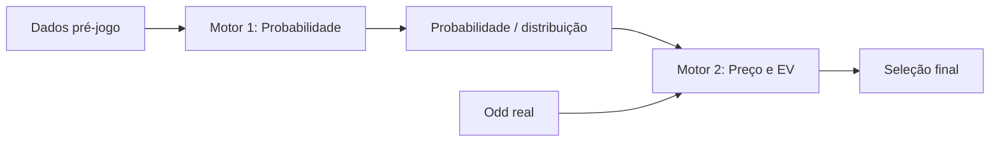
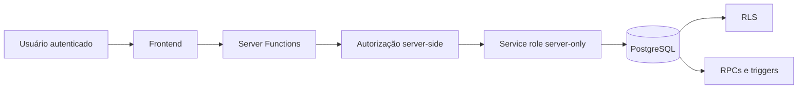
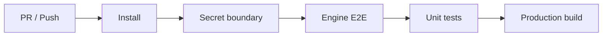

# Arquitetura — Value Bet Finder

## Objetivo

Este documento apresenta a arquitetura do sistema em uma visão de portfólio: principais camadas, boundaries, fontes de verdade e decisões que permitem combinar velocidade low-code com regras de negócio versionadas.

---

## Visão de alto nível



---

## Camadas

### 1. Interface

Responsável por:

- upload e validação do CSV;
- estados de processamento;
- conferência de preços;
- resultado da análise;
- acompanhamento de apostas;
- analytics.

A interface foi iterada com apoio do Lovable, mas continua versionada no GitHub como React/TypeScript.

### 2. Server Functions

As ações que dependem de credenciais, banco ou regras críticas são executadas no servidor.

Exemplos:

- preparar uma análise;
- buscar odds automáticas;
- avaliar valor;
- confirmar uma aposta registrada externamente;
- encerrar uma aposta;
- calcular analytics.

### 3. Adapters

Os adapters isolam particularidades das fontes externas.

Eles são responsáveis por:

- chamadas à API;
- paginação;
- normalização de estruturas;
- tratamento de indisponibilidade;
- compatibilização de identificadores;
- preservação de metadados de origem.

Isso evita que o motor quantitativo dependa diretamente do formato de um fornecedor.

### 4. Quant Engine

A camada `src/lib/engine/` concentra regras puras e testáveis.

Ela inclui:

- modelos de gols;
- escanteios;
- cartões;
- Elo;
- política de mercados;
- cálculo de valor;
- validação de features;
- seleção de portfólio;
- CLV.

Sempre que possível, a lógica é mantida determinística e desacoplada de UI e banco.

### 5. Banco e integridade

O PostgreSQL/Supabase não é usado apenas como armazenamento.

Ele também participa da proteção das regras por meio de:

- migrations versionadas;
- RLS;
- RPCs;
- triggers;
- locks e operações atômicas;
- constraints e validações transacionais.

---

## Fluxo de análise



---

## Separação entre Motor 1 e Motor 2

Uma das decisões mais importantes do sistema é separar previsão esportiva e avaliação de preço.



### Motor 1

- não recebe odd como feature;
- trabalha apenas com dados temporalmente válidos;
- pode bloquear um mercado por falta de dados ou validação.

### Motor 2

- recebe uma previsão já pronta;
- compara probabilidade e odd;
- calcula fair odd, edge e EV;
- aplica regras de execução e portfólio.

---

## Estratégia low-code

A arquitetura foi pensada para permitir mudanças rápidas sem colocar a lógica central dentro do construtor visual.

```text
Lovable
  └─ acelera UI, iteração e publicação

GitHub / TypeScript
  └─ protege regras, testes e histórico

Supabase / PostgreSQL
  └─ protege dados, transações e permissões
```

Essa combinação reduz lock-in operacional e facilita auditoria.

---

## Fontes de verdade

### Lovable Cloud

Fonte de verdade para:

- runtime publicado;
- banco em uso;
- ambiente operacional.

### GitHub `main`

Fonte de verdade para:

- código;
- migrations;
- testes;
- contratos de mercado;
- regras quantitativas;
- documentação técnica.

---

## Segurança por camadas



Controles principais:

- autenticação Google;
- allowlist validada no servidor;
- service role fora do bundle do cliente;
- browser sem acesso operacional direto às tabelas;
- RLS habilitado;
- endpoint de sync com Bearer secret;
- CSP e headers de segurança;
- operações financeiras do piloto protegidas no banco.

---

## Observabilidade e rastreabilidade

O projeto registra contexto suficiente para reconstruir decisões importantes:

- `run_id`;
- `prediction_id` versionado;
- dados de origem;
- timestamps;
- modelo e versão da política;
- preços usados;
- estado da aposta;
- histórico de banca.

A intenção é que uma decisão não exista apenas como resultado visual, mas como registro explicável.

---

## Qualidade

O pipeline de CI valida o repositório a cada mudança relevante:



Além do CI, o sistema passou por auditorias independentes de:

- RLS;
- segurança;
- backend;
- frontend;
- limpeza de código pós-auditoria.

---

## Estrutura principal

```text
src/
  components/               componentes de produto
  integrations/             Supabase / Lovable
  lib/adapters/             fontes e normalização
  lib/engine/               domínio quantitativo
  lib/*.functions.ts        operações server-side
  routes/                   experiência e navegação

supabase/
  migrations/               evolução do schema
  tests/                    segurança e RLS

docs/
  CASE_STUDY.md             narrativa de portfólio
  ARCHITECTURE.md            este documento
  PROJECT_STATE.md           continuidade operacional
```

---

## Princípio central

A arquitetura busca equilibrar duas coisas que normalmente entram em conflito:

> **velocidade de construção** e **controle técnico**.

O low-code acelera a camada de produto; regras, dados, segurança e qualidade permanecem explícitos, testáveis e versionados.
